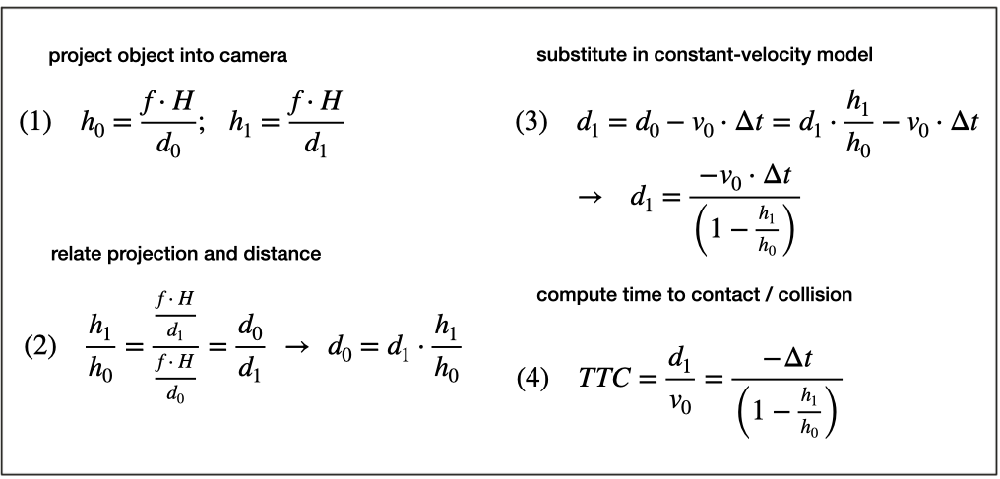

# SFND 3D Object Tracking
## [Rubric](https://review.udacity.com/#!/rubrics/2550/view)
By completing all the lessons, I got a solid understanding of keypoint detectors, descriptors, and methods to match them between successive images. Also, I leant how to detect objects in an image using the YOLO deep-learning framework. And finally, I leant how to associate regions in a camera image with Lidar points in 3D space.

```2D_Feature Tracking:``` [Mid-Term_Project](https://github.com/adamanov/SFND_2D_Feature_Tracking)


## TASKS:
### 1. Match 3D Objects
YOLO is well know Deep Learning algoirthm which can very fast produce boundingbox with live camera.
By using the YOLOv3 framework, we can extract a set of objects from a camera image that are represented by an enclosing rectangle (a "region of interest" or ROI) as well as a class label that identifies the type of object, e.g. a vehicle.

  

The objective of this task is to implement the method "matchBoundingBoxes", which takes as input both the previous and the current data frames and provides as output the IDs of the matched regions of interest. (i.e the boxID property)
-   Implementation overview:
1.  For each bounding ox in the current frame (currFrameBBox), iterate through all the keypoint matches.
2.  If we find a bounding box containing currFramePoint, we then consider its matched previous frame (prevFramePoint) and we try to find the associated bounding box ID (prevFrameBBOx.boxID)
3.  Store how many correspondences there are between the currFrameBBox and the PrevFrameBBox
4.  The prevFrameBBox with highest number of the keypoint correspondences is finally considered to be the best match  

``` C++ 
void matchBoundingBoxes(std::vector<cv::DMatch> &matches, std::map<int, int> &bbBestMatches, DataFrame &prevFrame, DataFrame &currFrame)

  for (auto descr = matches.begin(); descr != matches.end(); ++descr)
    for (auto pBox = prevFrame.boundingBoxes.begin(); pBox != prevFrame.boundingBoxes.end(); ++pBox)
      if (pBox->roi.contains(prevFrame.keypoints[idxPrevious].pt) )
        for (auto cBox = currFrame.boundingBoxes.begin(); cBox != currFrame.boundingBoxes.end(); ++cBox)
          if (cBox->roi.contains(currFrame.keypoints[idxCurrent].pt))
          count.at<int>(prevBoxID,currBoxID) = count.at<int>(prevBoxID,currBoxID) + 1;
```


### 2. Compute Lidar-based TTC
Compute the time-to-collision in second for all matched 3D objects using only Lidar measurements from the matched bounding boxes between current and previous frame

  

The sensor in this scenario will give us the distance to the closest 3D point in the path of driving. In the figure below, the closest point is indicated by a red line emanating from a Lidar sensor on top of the CAS vehicle.
Based on the model of a constant-velocity we discussed in the last section, the velocity can be computed from two successive Lidar measurements.

Once the relative velocity is known, the time to collision can easily be computed by dividing the remaining distance between both vehicles by. So given a Lidar sensor which is able to take precise distance measurements, a system for TTC estimation can be developed based based on a CVM and on the set of equations shown above

Even though Lidar is a reliable sensor, erroneous measurements may still occur. E.g, a small number of points is located behind the tailgate, seemingly without connection to the vehicle. When searching for the closest points, such measurements will pose a problem as the estimated distance will be too small. There are ways to avoid such errors by post-processing the point cloud, but there will be no guarantee that such problems will never occur in practice.

##### PreProcessing of LidarPoints in order to get rid of random points was implemented. KD-Tree and Euclidean cluster based on distance threshold and min cluster size algorithms were integrated 

``` c++
void computeTTCLidar(std::vector<LidarPoint> &lidarPointsPrev, 
                     std::vector<LidarPoint> &lidarPointsCurr, double frameRate, double &TTC)
```
    
### 3. Associate Keypoint Correspondences with Bounding Boxes
When observed closely however, it can be seen that the bounding boxes do not always reflect the true vehicle dimensions and the aspect ratio differs between images. Using bounding box height or width for TTC computation would thus lead to significant estimation errors.

 

Instead of relying on the detection of the vehicle as a whole we now want to analyze its structure on a smaller scale. If it were possible to locate uniquely identifiable keypoints that could be tracked from one frame to the next, we could use the distance between all keypoints on the vehicle relative to each other to compute a robust estimate of the height ratio in out TTC equation. The following figure illustrates the concept.

  

##### To do that, a robust mean of all the euclidean distances between keypoint matches were computed and then removed those that are too far away from the mean

``` c++ 
void clusterKptMatchesWithROI(BoundingBox &boundingBox, std::vector<cv::KeyPoint> &kptsPrev,
                                                        std::vector<cv::KeyPoint> &kptsCurr, 
                                                        std::vector<cv::DMatch> &kptMatches)
```

### 4. Compute Camera-based TTC
With a 2D camera however, the process of TTC computation is more complicated: First, the camera does not perform 3D measurements but only captures a 2D image of the scene. Second, we need to reliably and accurately identify vehicles in order to track their motion over time. 
To compute the TTC, we need to rely on the scale change of a vehicle (i.e. its increase in size on the image sensor in successive frames).

    

```c++ 
void computeTTCCamera(std::vector<cv::KeyPoint> &kptsPrev, std::vector<cv::KeyPoint> &kptsCurr, 
                      std::vector<cv::DMatch> kptMatches, double frameRate, double &TTC, cv::Mat *visImg)
```

### 5. Performance Evaluation 1
`Find examples where the TTC estimate of the Lidar sensor does not seem plausible. Describe your observations and provide a sound argumentation why you think this happened.`

Even though KD-Tree and Euclidean clustering based on distance threshold were implemented. We can still see some noise or outliers on the top view.

    

The reason of such as noice could be:
- lack of lidar sensor calibration
- curvature shape of front vehicle 
- reflection from other vehicle 

To improve a measurement of lidar:
- fusion with camera
- implement Kalman Filter to improve measurement perfomance 
- increase density of point cloud.

There are several reasons that leads to inaccurate camera-based TTC estimation:

Key-points mismatching, e.g. the key-point detected from turn signal lamp matches to the key-point on the roof in scenario 1.
Sensitive scale change and significant contrast change. In scenario 2, some key-points from the rear part of the roof in previous frame associate with the key-points from front part of the roof in current frame. Part of the reason is due to contrast change from lighting conditions or occlusion. It makes the distance ratio between two frames very close to 1, so our host vehicle and preceding vehicle looks relatively static between 2 frames and our TTL turns out to be a pretty large value at the end.

There are several ways that you can improve it:

Use more complex detector/descriptor combinations, e.g. SIFT, SIFT uses the Euclidean distance between two feature vectors as the similarity criteria of the two key points and uses the nearest neighbor algorithm to match each other. These kind of detector/descriptor is more accurate than any other descriptors and able to provide rotation and scale invariant.
Fuse with LiDAR sensor, so that camera can provide more semantic information, such as key-points and matches between multiple frames, and LiDAR and provide more accurate direct distance measurement.
Compare multiple frames instead of only considering 2 consecutive frames.
Add Kalman filter to tracking TTC by minimalizing covariance

### 6. Performance Evaluation 2
`
Run several detector / descriptor combinations and look at the differences in TTC estimation. Find out which methods perform best and also include several examples where camera-based TTC estimation is way off. As with Lidar, describe your observations again and also look into potential reasons.
`

There are several ways of showing which methods perform best, following metrics were implemented:

- Minimum TTC in seconds
- Maximum TTC in seconds
- Standard Deviation in seconds
- Mean in second

[check out results](images/results.txt)

  | _Detector_/Descriptor |BRISK	    | BRIEF	  |ORB	    |FREAK	            |AKAZE	|SIFT    |  
  | --------------------|-----------|---------|---------|-------------------|-------|--------|  
  | **_HARRIS_**          |	N/A	      | N/A	    |N/A	    |N/A	              |N/A	  |N/A     |  
  | **_FAST_**            | 44,9166	  |44,8166	|63,8475	|Descriptor failed	|Error	|34,3656 |  
  | **_BRISK_**           | 44,9166	  |44,9166	|63,8475	|Descriptor failed	|Error	|34,3656 |  
  | **_ORB_**             | 44,9166	  |44,9166	|63,8475	|Descriptor failed	|Error	|34,3656 |  
  | **_AKAZE_**           | 44,9166	  |44,9166	|63,8475	|Descriptor failed	|Error	|34,3656 |  
  | **_SIFT_**            | 44,9166	  |44,9166	|63,8475	|Descriptor failed	|Error	|34,3656 |  
  

The combination of different detector / descriptor were also done in [Mid-Term](https://github.com/adamanov/SFND_2D_Feature_Tracking) project where It worked well and could be calculated top3.
